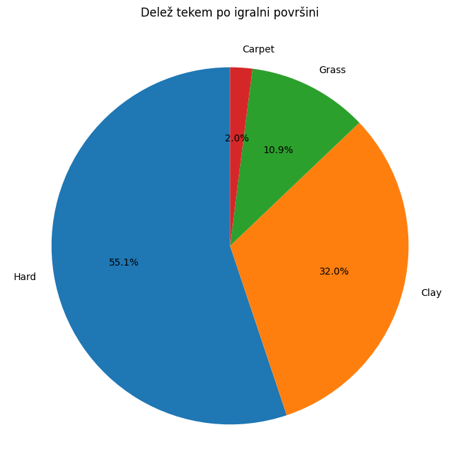
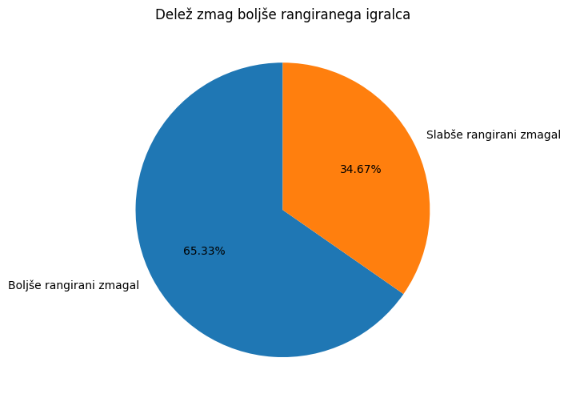
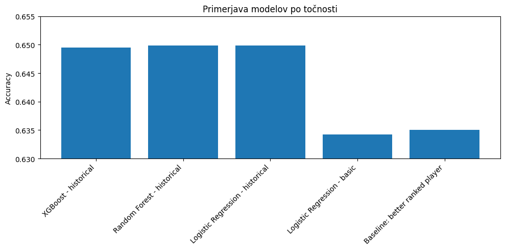
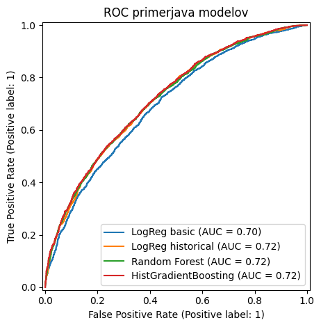
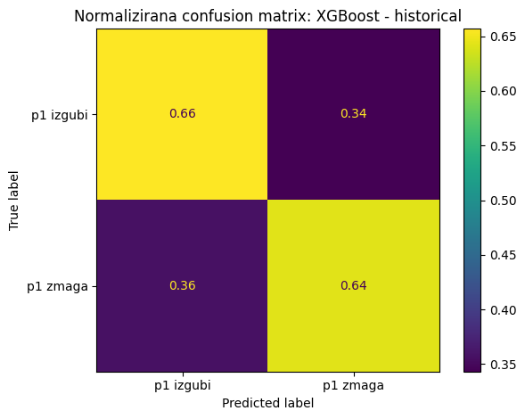
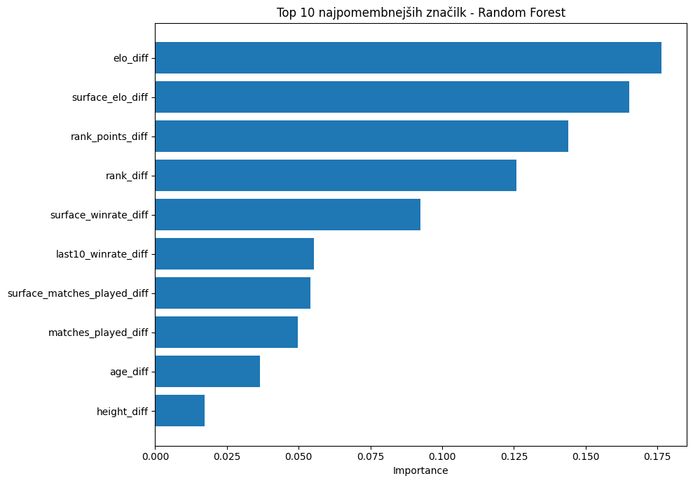
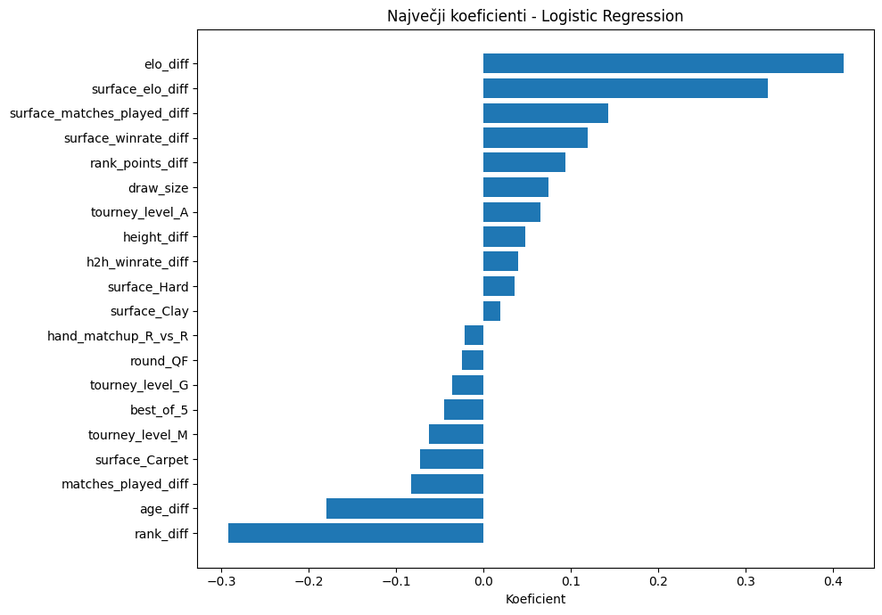

# Napovedovanje zmagovalcev ATP teniških tekem

**Avtorji:** Nik Javor, Nika Labazan, Anže Barle Čuk, Irna Nuhić  
**Predmet:** Podatkovno rudarjenje  
**Študijsko leto:** 2025/2026


## 1. Uvod

Cilj projekta je izdelati model, ki na podlagi podatkov pred začetkom teniške tekme napove zmagovalca ATP dvoboja. Problem smo obravnavali kot binarno klasifikacijo: za vsako tekmo napovedujemo, ali bo zmagal igralec `p1` ali igralec `p2`.

Projekt smo razdelili na tri glavne dele:

1. priprava in analiza podatkov,
2. izdelava značilk,
3. treniranje in primerjava modelov.

Pri učenju smo posebej pazili, da model ne uporablja podatkov, ki so znani šele po začetku ali koncu tekme, saj bi to povzročilo uhajanje informacij.


## 2. Podatki

Podatke smo pridobili iz repozitorija [JeffSackmann/tennis_atp](https://github.com/JeffSackmann/tennis_atp). Uporabili smo datoteke z ATP tekmami od leta 2000 do 2024. Podatki za leti 2025 in 2026 so bili predvideni kot dodaten preizkus modela na novejših podatkih.

Vsaka vrstica predstavlja eno tekmo in vsebuje podatke o turnirju, igralni površini, datumu, zmagovalcu, poražencu, rankingu, starosti, višini in drugih značilkah igralcev.

V model nismo vključili statistik iz same tekme, kot so:

```text
score, minutes, w_ace, l_ace, w_df, l_df, w_svpt, l_svpt, ...
```

Te vrednosti so znane šele med tekmo ali po njej, zato niso primerne za napoved pred tekmo.


## 3. Priprava podatkov

Najprej smo združili podatke iz več let v enoten dataset. Stolpec `tourney_date` smo pretvorili v datumski format in iz njega izračunali leto tekme.

Izločili smo tekme, ki niso bile običajno zaključene, na primer walkoverje, predaje in default tekme. Odstranili smo tudi vrstice brez ključnih podatkov, kot so identifikator igralca, ranking ali igralna površina.

Izvorni podatki so zapisani v obliki `winner` in `loser`. Za modeliranje smo jih pretvorili v obliko:

```text
p1, p2, target
```

Če je zmagal igralec `p1`, je `target = 1`, sicer je `target = 0`. Igralca `p1` smo določili naključno, da model ne bi mogel sklepati iz samega položaja igralca v tabeli.

Po čiščenju je v končnem datasetu ostalo **68.779 tekem** iz let 2000–2026 (samo nivoji Grand Slam, Masters, ATP in Finals). Po naključni dodelitvi p1/p2 je razred dejansko uravnotežen: `target = 0` v 50,21 % in `target = 1` v 49,79 % tekem, zato točnost 50 % ustreza naključnemu ugibanju.

Porazdelitev rok igralcev (`hand_matchup`) je močno asimetrična: `R_vs_R` 51.947 tekem, `L_vs_R` 7.822, `R_vs_L` 7.760 in `L_vs_L` le 1.137 tekem. Levičarji so torej zastopani v okoli 25 % vseh dvobojev.


## 4. Analiza podatkov

V raziskovalni analizi smo pregledali osnovne lastnosti podatkov:

- število tekem po letih,

   

- porazdelitev tekem po igralnih površinah,

  

- porazdelitev tekem po nivojih turnirjev,
- manjkajoče vrednosti,
- delež zmag bolje rangiranega igralca,

  

- vpliv razlike v rankingu na verjetnost zmage favorita.

**[VSTAVI GRAF: manjkajoče vrednosti pomembnih stolpcev]**


Bolje rangirani igralec je v celotnem datasetu zmagal v **63,50 %** tekem. To je močan signal, ki hkrati določa zgornjo mejo preprostega baseline modela "zmaga favorit po rankingu". Delež zmag favorita se nekoliko razlikuje po površinah:

| Površina | Število tekem | Delež zmag favorita |
|---|---:|---:|
| Hard | 37.925 | 65,90 % |
| Grass | 7.485 | 65,56 % |
| Clay | 21.991 | 64,46 % |
| Carpet | 1.378 | 62,34 % |

Najmanj predvidljiva površina je carpet, kjer favorit zmaga le v 62 % primerov, a tudi tu so razlike med površinami majhne (znotraj 3,5 odstotnih točk). Analiza po razliki v rankingu je pokazala pričakovan vzorec: pri razliki nad 500 mest favorit zmaga skoraj vedno, pri razliki 0–10 mest pa je verjetnost zmage blizu 50 %.

Osnovna analiza je pokazala, da je ranking pomemben napovedni signal, vendar sam po sebi ni dovolj. Zato smo poleg osnovnih podatkov dodali tudi zgodovinske značilke igralcev.


## 5. Izdelava značilk

Osnovne značilke so bile izračunane kot razlike med igralcema `p1` in `p2`:

```text
rank_diff
rank_points_diff
age_diff
height_diff
p1_better_ranked
abs_rank_diff
```

Dodali smo tudi značilke turnirja:

```text
surface
tourney_level
best_of
round
hand_matchup
```

Pri višini igralcev smo manjkajoče vrednosti najprej poskusili dopolniti iz datoteke `atp_players.csv`, nato pa preostale manjkajoče vrednosti nadomestili z mediano.


## 6. Zgodovinske značilke

Za boljši opis trenutne moči igralcev smo izračunali zgodovinske značilke. Pomembno je, da so bile vse te značilke izračunane kronološko: za posamezno tekmo smo uporabili samo podatke iz tekem, ki so se zgodile pred njo.

Uporabljene zgodovinske značilke:

```text
elo_diff
surface_elo_diff
last10_winrate_diff
surface_winrate_diff
matches_played_diff
surface_matches_played_diff
h2h_matches
h2h_winrate_diff
surface_h2h_matches
surface_h2h_winrate_diff
last_h2h_result
```

Elo rating meri splošno moč igralca glede na pretekle rezultate. Poleg splošnega Elo ratinga smo izračunali tudi Elo rating po posamezni površini. To modelu omogoča, da zajame razlike med igralci na različnih površinah, na primer da je nek igralec boljši na pesku kot na travi.

Dodali smo tudi formo v zadnjih desetih tekmah in zgodovino medsebojnih dvobojev med igralcema.

Korelacije novih značilk s ciljno spremenljivko `target` potrjujejo, da imata Elo in surface Elo daleč najmočnejši signal:

| Značilka | Korelacija s `target` |
|---|---:|
| elo_diff | 0,391 |
| surface_elo_diff | 0,375 |
| surface_winrate_diff | 0,306 |
| last10_winrate_diff | 0,302 |
| h2h_winrate_diff | 0,143 |
| last_h2h_result | 0,130 |

Še preprosteje povedano: ko ima `p1` višji Elo od `p2`, dejansko zmaga v **65,85 %** primerov, ko ima nižji Elo, pa le v **33,75 %**. Razlika v Elo torej že sama po sebi grobo loči zmagovalca od poraženca.

Head-to-head značilke pa imajo bistveno manjši doseg, kot bi pričakovali: le **45,9 %** tekem ima v zgodovini vsaj en predhodni medsebojni dvoboj, samo **30,7 %** pa ima H2H na isti površini. Pri večini tekem zato H2H značilke vrnejo nevtralno vrednost (0,5), kar omeji njihov doprinos.

Lep primer, zakaj je Elo po površini pomemben, ponuja pesek: vseh **10 tekem z največjo razliko `surface_elo_diff` na pesku je Nadalovih** (njegov clay Elo ≥ 2200 proti nasprotnikom okrog 1450) in vseh teh 10 tekem je dobil. Splošni Elo bi mu na pesku verjetno podcenil možnosti, surface Elo pa to ujame.


## 7. Modeliranje

Podatke smo razdelili časovno, saj želimo simulirati realno napovedovanje prihodnjih tekem:

| Del | Leta | Število tekem |
|---|---:|---:|
| Train | 2000–2021 | 57.281 |
| Validation | 2022 | 2.620 |
| Test | 2023–2024 | 5.389 |
| Future test | 2025–2026 | 3.489 |

Primerjali smo naslednje modele:

1. baseline model: zmaga bolje rangirani igralec,
2. logistična regresija z osnovnimi značilkami,
3. logistična regresija z zgodovinskimi značilkami,
4. naključni gozd z zgodovinskimi značilkami,
5. XGBoost z zgodovinskimi značilkami.

Modele smo vrednotili z metrikami accuracy, AUC in log loss.


## 8. Rezultati

Rezultati na testnem delu podatkov iz let 2023–2024 so bili:

| Model | Accuracy | AUC | Log loss |
|---|---:|---:|---:|
| XGBoost - historical | 0,6495 | **0,7209** | **0,6122** |
| Random Forest - historical | **0,6498** | 0,7178 | 0,6141 |
| Logistic Regression - historical | **0,6498** | 0,7173 | 0,6162 |
| Logistic Regression - basic | 0,6343 | 0,6962 | 0,6359 |
| Baseline: better ranked player | 0,6350 | 0,6350 | / |







Rezultati kažejo, da zgodovinske značilke izboljšajo uspešnost modela. Logistična regresija z osnovnimi značilkami je dosegla AUC 0,6962, z dodatkom zgodovinskih značilk pa 0,7173. Najboljši XGBoost doseže AUC 0,7209, kar je **8,6 odstotnih točk več kot baseline** (0,6350) in **2,5 odstotnih točk več kot LogReg na osnovnih značilkah**. To pomeni, da Elo, surface Elo, forma in medsebojni dvoboji dodajo pomembne informacije.

Med modeli z zgodovinskimi značilkami so razlike majhne (vse v razponu 0,003 AUC). Po accuracy sta najboljša Random Forest in logistična regresija (0,6498), po AUC in log loss pa XGBoost. Ker sta AUC in log loss pomembni metriki za verjetnostne napovedi, smo kot končni model izbrali XGBoost z zgodovinskimi značilkami.


## 9. Interpretacija

Najpomembnejše značilke pri modelu Random Forest (relativni delež):

| Značilka | Pomembnost |
|---|---:|
| elo_diff | 0,176 |
| surface_elo_diff | 0,165 |
| rank_points_diff | 0,144 |
| rank_diff | 0,126 |
| surface_winrate_diff | 0,092 |
| last10_winrate_diff | 0,055 |
| surface_matches_played_diff | 0,054 |
| matches_played_diff | 0,050 |
| age_diff | 0,036 |
| height_diff | 0,017 |

Prvih osem mest zasedejo zgodovinske in ranking značilke; skupaj prispevajo več kot 86 % celotne pomembnosti. Značilke turnirja (površina, nivo, krog) in matchup rok imajo posamično pomembnost manj kot 0,01.



Pri logistični regresiji koeficienti potrjujejo enako sliko in dodajo smer vpliva:

| Značilka | Koeficient |
|---|---:|
| elo_diff | +0,412 |
| surface_elo_diff | +0,326 |
| rank_diff | -0,292 |
| age_diff | -0,179 |
| surface_matches_played_diff | +0,143 |
| surface_winrate_diff | +0,119 |
| rank_points_diff | +0,093 |
| matches_played_diff | -0,083 |

Pozitivni koeficienti pomenijo, da večja vrednost značilke poveča verjetnost zmage igralca `p1`. `elo_diff` in `surface_elo_diff` torej delujeta v pričakovani smeri. Značilka `rank_diff` ima negativen predznak, ker večja pozitivna vrednost pomeni, da ima `p1` slabši ranking (večja številka rankinga = slabši igralec). Negativen koeficient pri `age_diff` nakazuje rahlo prednost mlajšega od dveh igralcev.




## 10. Zanimive napovedi

Z analizo posameznih napovedi XGBoost modela na testni množici 2023–2024 dobimo dober občutek, kdaj model "ve" in kdaj se ujame v past zgodovinske statistike.

### Samozavestne in pravilne napovedi

Najbolj samozavestne pravilne napovedi so vse zgodnje tekme dominantnih igralcev na Grand Slamih, kjer Elo in surface Elo ogromno razlikujeta favorita od kvalifikanta:

| Datum | Turnir | Igralec p1 | Igralec p2 | p(p1 zmaga) |
|---|---|---|---|---:|
| 26. 8. 2024 | US Open | Carlos Alcaraz | Li Tu | 0,988 |
| 26. 8. 2024 | US Open | Jannik Sinner | Christopher Oconnell | 0,981 |
| 26. 8. 2024 | US Open | Alexander Zverev | Maximilian Marterer | 0,979 |
| 27. 5. 2024 | Roland Garros | Carlos Alcaraz | J J Wolf | 0,979 |
| 27. 5. 2024 | Roland Garros | Jannik Sinner | Christopher Eubanks | 0,977 |
| 3. 7. 2023 | Wimbledon | Novak Djokovic | Stan Wawrinka | 0,973 |

Pri vseh tekmah je p1 dejansko tudi zmagal.

### Veliki upseti, ki jih model zgreši

Najbolj samozavestne napačne napovedi so klasična teniška presenečenja, ki jih predtekmovalni signali ne morejo napovedati:

| Datum | Turnir | Igralec p1 | Igralec p2 | p(p1 zmaga) | Dejanski izid |
|---|---|---|---|---:|---|
| 26. 8. 2024 | US Open | Carlos Alcaraz | Botic Van De Zandschulp | 0,970 | p2 zmaga |
| 15. 1. 2024 | Australian Open | Nuno Borges | Grigor Dimitrov | 0,038 | p1 zmaga |
| 16. 1. 2023 | Australian Open | Michael Mmoh | Alexander Zverev | 0,038 | p1 zmaga |
| 29. 5. 2023 | Roland Garros | Daniil Medvedev | Thiago Seyboth Wild | 0,952 | p2 zmaga |
| 4. 3. 2024 | Indian Wells | Luca Nardi | Novak Djokovic | 0,063 | p1 zmaga |
| 15. 1. 2024 | Australian Open | Holger Rune | Arthur Cazaux | 0,936 | p2 zmaga |

Posebej zanimiv je poraz Alcaraza proti Van de Zandschulpu v 2. krogu US Opena 2024, ki ga je model favoriziral z verjetnostjo 97 %. Ti primeri lepo ilustrirajo razdelek o omejitvah: brez dnevne forme, poškodb in psihološkega stanja je takšne preobrate praktično nemogoče napovedati.


## 11. Omejitve

Model ne vključuje vseh dejavnikov, ki lahko vplivajo na izid tekme. Med pomembnimi manjkajočimi informacijami so poškodbe, utrujenost, dnevna forma, vremenske razmere, motivacija in psihološki pritisk.

Poleg tega imajo mladi igralci ali igralci z malo preteklimi tekmami manj zanesljive zgodovinske značilke. Head-to-head značilke so uporabne predvsem pri parih igralcev, ki so se že večkrat srečali, pri številnih tekmah pa medsebojnih dvobojev še ni bilo (le 45,9 % tekem v datasetu ima predhodni H2H).


## 12. Zaključek

V projektu smo izdelali model za napovedovanje zmagovalcev ATP teniških tekem. Glavna izboljšava glede na osnovni pristop je bila uporaba zgodovinskih značilk, kot so Elo rating, Elo rating po površini, forma v zadnjih tekmah in medsebojni dvoboji.

Rezultati kažejo, da zgodovinske značilke izboljšajo napovedno moč modelov. Najboljši AUC in najnižji log loss je dosegel XGBoost z zgodovinskimi značilkami, zato smo ga izbrali kot končni model. Logistična regresija je dosegla zelo podobno točnost in je uporabna predvsem za razlago vpliva posameznih značilk.

Glavna ugotovitev projekta je, da je kakovost značilk pomembnejša od izbire kompleksnega modela. Dobro pripravljene zgodovinske značilke modelu omogočijo boljšo oceno trenutne moči igralcev in s tem boljše napovedi izidov tekem.

